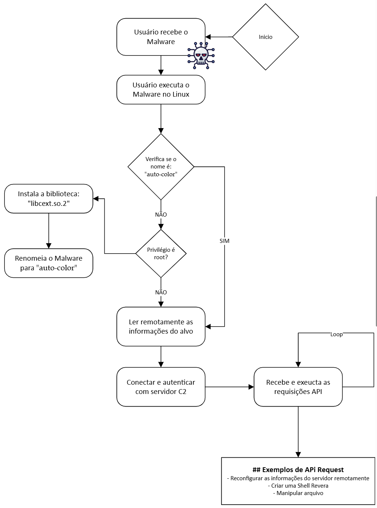

# Análise Detalhada do Malware "Auto-Color"

Esta análise detalha as técnicas, funcionalidades e impactos do malware **Auto-Color**, um malware para Linux identificado em ataques direcionados entre novembro e dezembro de 2024, com foco em alvos como universidades e órgãos governamentais na América do Norte e Ásia.

## Sumário

1. [Método de Infecção e Propagação](#1-método-de-infecção-e-propagação)
2. [Técnicas de Evasão Utilizadas](#2-técnicas-de-evasão-utilizadas)
3. [Funções e Impacto no Sistema Infectado](#3-funções-e-impacto-no-sistema-infectado)
4. [Medidas de Mitigação e Prevenção](#4-medidas-de-mitigação-e-prevenção)
5. [Comparação com Outras Ameaças Semelhantes](#5-comparação-com-outras-ameaças-semelhantes)

---
## Fluxo de Ataque

---

## 1. Método de Infecção e Propagação

- **Contexto:**  
  O Auto-Color foi descoberto em ataques direcionados, tendo como alvos universidades e órgãos governamentais na América do Norte e Ásia  

- **Vetor de Infecção:**  
  Não há clareza sobre o vetor inicial. Suspeita-se que a infecção ocorra via engenharia social ou após uma invasão prévia, exigindo que o arquivo malicioso seja executado manualmente no Linux.  

- **Disfarce do Malware:**  
  Utiliza nomes aparentemente inofensivos (ex.: “door”, “egg” ou “log”) para aumentar as chances de execução, enganando administradores e usuários desatentos.  

- **Propagação:**  
  O malware não se propaga automaticamente (não é um worm). A infecção é limitada e manual, focando em persistir e fornecer acesso remoto.

---

## 2. Técnicas de Evasão Utilizadas

O Auto-Color emprega diversas táticas para se ocultar e dificultar a detecção:

### Nomes de Arquivos Disfarçados

- **Inicial:**  
  O malware chega com nomes benignos para evitar suspeitas.  

- **Renomeação e Ocultação:**  
  Após a instalação, renomeia-se para “auto-color” e é movido para o diretório `/var/log/cross/auto-color`, simulando ser parte legítima do sistema.  

- **Eliminação do Instalador:**  
  O arquivo original é apagado para remover vestígios do processo de infecção.  

### Biblioteca Maliciosa Camuflada

- **Instalação com Privilégios:**  
  Se executado como root, instala a biblioteca `libcext.so.2`, imitando uma biblioteca legítima (como `libcext.so.0`).  

- **Persistência via LD_PRELOAD:**  
  A biblioteca é registrada em `/etc/ld.preload`, garantindo sua carga em todos os processos e injetando um rootkit em nível de usuário.  

### Hooking de Funções do Sistema

- **Interceptação de Chamadas:**  
  A biblioteca maliciosa intercepta a função `open()` da libc, ocultando conexões maliciosas durante a inspeção do arquivo `/proc/net/tcp`.  

- **Referência:**  
  Técnica semelhante à utilizada pelo malware Symbiote (2022).

### Persistência e Proteção Contra Remoção

- **Proteção do Arquivo de Preload:**  
  O malware protege o arquivo `/etc/ld.preload` contra modificações, dificultando tentativas de remoção.  

### Comunicação Criptografada e Configuração Oculta

- **Criptografia Proprietária:**  
  Utiliza algoritmos próprios para ofuscar tanto a configuração (como o endereço do C2) quanto o tráfego de rede.  

- **Chaves Dinâmicas:**  
  Cada comunicação é cifrada com chaves que mudam a cada requisição, e cada sample possui um IP de C2 diferente, resultando em hashes únicos.

### Execução Adaptativa (Evasão de Privilégios)

- **Modo Não-Root:**  
  Caso seja executado sem privilégios administrativos, o malware não tenta modificar o sistema para evitar erros e alertas.  

- **Execução Parcial:**  
  Opera em modo de usuário, mantendo acesso remoto temporário até que privilégios sejam elevados.  

---

## 3. Funções e Impacto no Sistema Infectado

Após a infecção, o Auto-Color atua como um backdoor completo, oferecendo as seguintes funcionalidades:

- **Acesso Remoto via Shell Reversa:**  
  Permite acesso interativo ao terminal do sistema infectado.  

- **Execução Arbitrária de Comandos:**  
  Habilita a execução de comandos e instalação de softwares, possibilitando escalada de privilégios.  

- **Criação e Modificação de Arquivos:**  
  Permite ler, criar, alterar ou excluir arquivos, possibilitando roubo ou destruição de dados.  

- **Operação como Proxy/Túnel:**  
  Transforma o sistema em um proxy para mascarar a origem das atividades maliciosas.  

- **Ajuste na Configuração:**  
  Permite alterações dinâmicas na configuração do malware (ex.: mudança do servidor C2).  

- **Mecanismo de Autodestruição (Kill Switch):**  
  Possui um comando que desinstala o malware e remove seus vestígios, dificultando investigações.  

- **Coleta de Informações:**  
  Reúne dados do sistema (versão do SO, programas instalados, etc.) para auxiliar o reconhecimento do ambiente.  

**Impacto Geral:**  
A infecção compromete a confidencialidade, integridade e disponibilidade do sistema, permitindo o roubo, modificação ou destruição de dados e facilitando movimentos laterais na rede.

---

## 4. Medidas de Mitigação e Prevenção

### Evitar a Infecção Inicial

- **Boas Práticas:**  
  - Não executar arquivos desconhecidos ou não confiáveis.  
  - Desconfiar de executáveis com nomes incomuns (ex.: “egg”, “auto-color”).
- **Treinamento:**  
  Capacitar usuários e administradores para identificar e evitar phishing.
- **Atualizações:**  
  Manter o sistema e softwares atualizados para reduzir vulnerabilidades.

### Princípio do Menor Privilégio

- **Restrição de Acesso:**  
  Evitar o uso desnecessário de contas root. Sem privilégios, o malware não consegue instalar componentes críticos.  

### Monitoramento de Arquivos Críticos

- **Integridade:**  
  Monitorar arquivos sensíveis como `/etc/ld.preload` e diretórios de bibliotecas (`/lib`, `/usr/lib`) para detectar alterações suspeitas.  

- **Ferramentas:**  
  Utilizar ferramentas como *rkhunter* ou *chkrootkit*.

### Análise de Conexões de Rede

- **Monitoramento:**  
  Comparar resultados de ferramentas (ex.: `ss`, `netstat`) com logs de firewall para identificar anomalias.
- **Inspeção Direta:**  
  Verificar o conteúdo de `/proc/net/tcp` para identificar manipulações.
- **Soluções Avançadas:**  
  Implementar análise comportamental para detectar padrões anômalos, mesmo em tráfego criptografado.

### Detecção Baseada em Comportamento

- **EDR/Antivírus:**  
  Investir em soluções específicas para Linux que monitorem chamadas de sistema suspeitas e utilizem heurísticas para identificar atividades maliciosas.  

### Auditoria de IoCs e Logs

- **Atualização Contínua:**  
  Manter-se informado sobre indicadores de comprometimento divulgados por pesquisadores.
- **Automatização:**  
  Utilizar SIEM para correlação de eventos e identificar comunicações com C2 conhecidos.  

### Resposta e Remoção Seguras

- **Isolamento:**  
  Desconectar imediatamente o sistema comprometido da rede para evitar movimentação lateral.
- **Remoção Especializada:**  
  Utilizar ferramentas especializadas ou suporte de equipes de resposta a incidentes.  
  Recomenda-se inicializar o sistema por meio de um live OS para remover vestígios (edição/remoção de `/etc/ld.preload`, exclusão de `libcext.so.2`, etc.).  

- **Reinstalação:**  
  Em ambientes críticos, considerar a reinstalação completa do sistema comprometido se necessário.

---

## 5. Comparação com Outras Ameaças Semelhantes

O Auto-Color integra uma tendência de malwares avançados para Linux que combinam técnicas de backdoor com rootkits em userland. A seguir, uma comparação com outras ameaças:

### Symbiote (2022)

- **Semelhanças:**  
  Atua como backdoor e rootkit, utilizando LD_PRELOAD e hooking da libc para ocultar tráfego.  

- **Diferenças:**  
  Possui funcionalidades adicionais para roubo de dados e credenciais (ex.: hooking de PAM) e exfiltração via DNS.  

### OrBit (2022)

- **Semelhanças:**  
  Instala um componente malicioso no userland para mascarar atividades, semelhante ao Auto-Color.  

- **Diferenças:**  
  Foca na captura de credenciais e informações, utilizando hooking em funções como libpcap e PAM.  

### HiddenWasp (2019)

- **Semelhanças:**  
  Combina trojan de acesso remoto com rootkit, visando controle total do sistema.  

- **Diferenças:**  
  Distribuído como um kit de três partes com comportamento de propagação lateral, diferentemente do Auto-Color que não se propaga automaticamente.  

**Contexto Geral:**  
Enquanto malwares tradicionais para Linux (como bots de DDoS, miners ou trojans simples) focavam em objetivos específicos, o Auto-Color e ameaças similares demonstram um nível elevado de sofisticação, privilegiando a furtividade e persistência com técnicas de rootkit e criptografia customizada.

---

## Conclusão

A complexidade e sofisticação do Auto-Color evidenciam a necessidade de estratégias robustas de segurança para proteger ambientes Linux. Administradores e profissionais de segurança devem adotar práticas de monitoramento contínuo, manter sistemas atualizados e investir em treinamento para identificar e responder rapidamente a incidentes.

---

### Referências

- THEHACKERNEWS.COM  
- BLEEPINGCOMPUTER.COM  
- UNIT42.PALOALTONETWORKS.COM  
- SECURITYINTELLIGENCE.COM  
- WIZ.IO  
- ACRONIS.COM  
- INTEZER.COM
